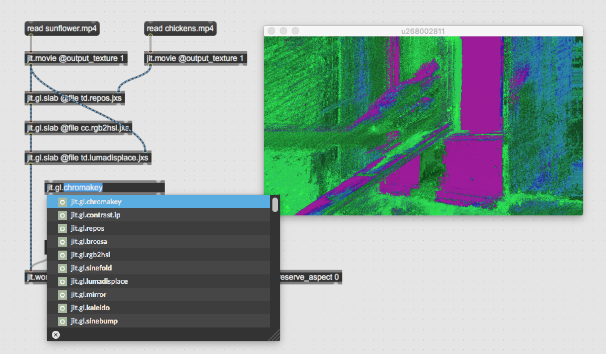

# gl.shadermappings

> [!WARNING]
> This package is deprecated. Please install the [AV Toolbox](https://github.com/tmhglnd/av-toolbox) through the Package Manager in Max8/9

Max has quite a few shaders build into the application. But if you want to patch with them you have to type `jit.gl.slab @file <shaderfile>` which is usually quite a hassle. Also you have to remember what the shader file name is. This simple objectmappings file will do all this work for you. How it works:

1. See all the shaderfiles in the autocomplete field when typing `jit.gl.`
2. Select the shaderfile and it will translate to `jit.gl.slab @file <shaderfile>`



## Support my projects

**Consider to [name a fair price](http://gumroad.com/tmhglnd)**

**or [become a patron](http://patreon.com/timohoogland)**

## Install

```
1. download zip
2. unzip and place in Max Packages (on MacOS ~/Documents/Max 8/Packages)
3. restart Max8
```

```
1. open terminal
2. $ cd ~/Documents/Max\ 8/Library
3. $ git clone https://github.com/tmhglnd/gl.shadermappings.git
4. restart Max8
```

## Build

If you want to build the list of mappings for Max yourself you can run the `main.js` program via `npm start`. Currenlty only made to run with Mac.

# License

MIT License

This program is distributed in the hope that it will be useful,
but WITHOUT ANY WARRANTY; without even the implied warranty of
MERCHANTABILITY or FITNESS FOR A PARTICULAR PURPOSE. See the
GNU General Public License for more details.